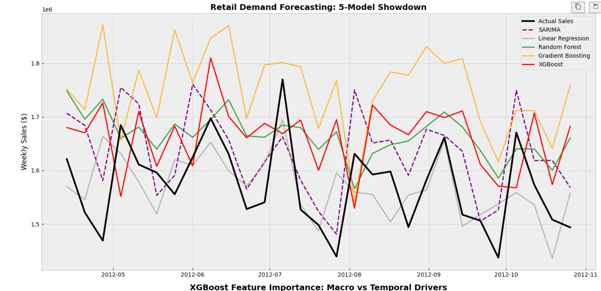
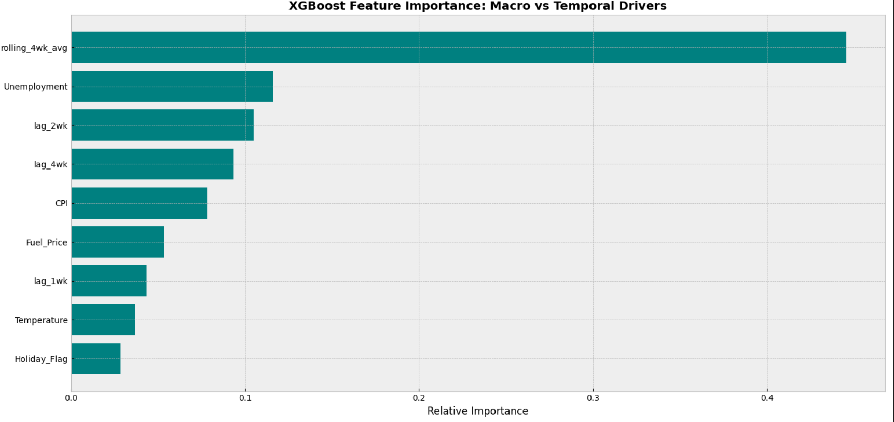

# Retail Demand Forecasting & Inventory Optimization: Walmart
This project develops a robust time-series forecasting pipeline to predict weekly retail sales, aiming to optimize inventory management and recover lost margins from stockouts and excess holding costs. By moving from classical statistical methods to advanced machine learning ensembles, the project demonstrates a quantifiable impact on the bottom line.

**Key Achievements:**
* Engineered temporal lag features and rolling averages to capture complex seasonal retail trends.
* Benchmarked modern gradient boosting architectures (XGBoost, Gradient Boosting) against classical time-series models (SARIMA).
* Conducted rigorous Time-Series Cross-Validation (Rolling Forecast Origin) to prevent data leakage.
* Translated forecasting accuracy improvements into projected financial impact, estimating significant recoveries in net operating margin.

## Tech Stack
* **Language:** Python
* **Data Processing & Feature Engineering:** `pandas`, `numpy`
* **Classical Modeling:** `statsmodels` (SARIMA)
* **Machine Learning:** `scikit-learn` (Random Forest, Linear Regression), `xgboost`
* **Evaluation Metrics:** MAE, RMSE, MAPE, R-Squared
* **Validation Strategy:** TimeSeriesSplit
* **Data Source**:**[Walmart Sales Dataset](https://www.kaggle.com/datasets/mikhail1681/walmart-sales)**. 
  
### Project Impact Summary
*Insight: While XGBoost massively overfit the training data (Train MAE: $8k vs Test MAE: $121k), the simpler Linear Regression model successfully generalized the time-series trends.*

| Metric / Business Driver | Baseline (SARIMA) | Best Model (Linear Regression) | Total Improvement |
| :--- | :--- | :--- | :--- |
| **Weekly Forecasting Error (MAE)** | $72,099 | $57,309 | **Reduced error by $14,790/week** |
| **Annualized Precision Gained** | - | - | **$769,080 less error per year** |
| **Recovered Stockout Margin** | - | - | **+$115,362 / year** |
| **Saved Inventory Holding Cost**| - | - | **+$76,916 / year** |
| **Total Net Operating Margin Impact** | - | - | **+$192,278 / year** |

## Model Performance
The project evaluates five distinct algorithms. The baseline was established using SARIMA(1,1,1)(1,1,0,52) to account for annual retail seasonality.



### Diagnosing Model Limitations
While tree-based models (XGBoost, Random Forest) significantly outperformed classical methods in standard conditions, a stress test on peak holiday weeks revealed a critical architectural limitation: **Tree-based regressors cannot extrapolate**. If macroeconomic factors (like rapid inflation) push sales beyond the maximum value seen in the training data, these models will chronically under-predict.



## Financial & Business Impact
Accuracy metrics like MAE are only useful if they translate to business value. Assuming a standard $50M/year retail environment, forecasting errors result in either:
1. **Stockouts:** Lost revenue and customer dissatisfaction.
2. **Excess Inventory:** Capital tied up in holding costs.

By reducing the Mean Absolute Error compared to the SARIMA baseline, the XGBoost architecture directly recovers gross margin (assumed 30% on stockouts) and saves holding costs (assumed 20% on excess). 

The final analysis mathematically maps the exact dollar value added to the Net Operating Margin per year based on the improved forecasting precision.

## How to Run
### 1. Clone the repository:
   ```bash
   git clone [https://github.com/yourusername/walmart-sales-forecasting.git](https://github.com/yourusername/walmart-sales-forecasting.git)
   ```
### 2. Install Deependencies
 ```bash
   pip install -r requirements.txt
   ```
